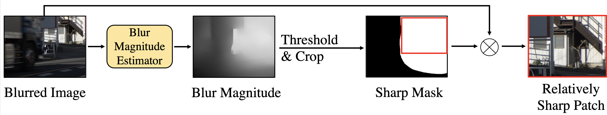

# Relative Sharpness Detection Module
This project aims to detect and crop the relatively sharp patches from an input video. With this module, we can extract the top r% of the sharpest patches from the video. For example, if a video contains 1000 frames and we want to obtain the top 20% of the sharpest patches, we will get 200 patches.

The details will be in our [ECCV 2024 Paper](https://arxiv.org/abs/2407.09059). The downstream task is our [DADeblur](https://github.com/Jin-Ting-He/DADeblur) for video deblurring.


## Dataset Structure
```bash
dataset/
├── video1/
│ ├── Blur/RGB/
├── video2/
│ ├── Blur/RGB/
├── video3/
│ ├── Blur/RGB/
```
## Model Weight
The upstream task is our Blur Magnitude Estimator, you can download model weight from this repo [BME](https://github.com/Jin-Ting-He/BME)

## Run
you need to replace the path in main.py line 108 - 113
```bash
python main.py
```